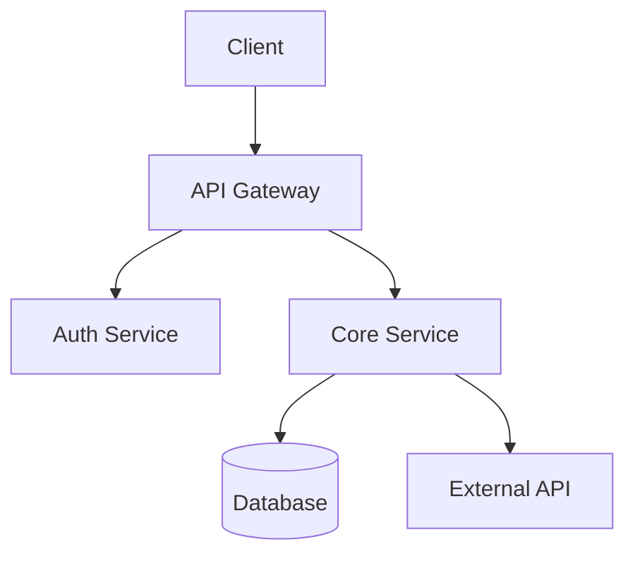
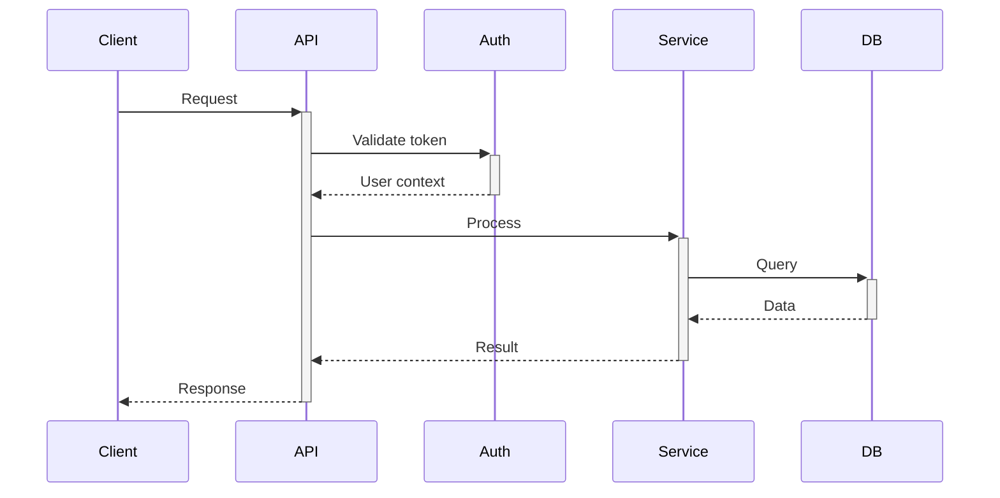
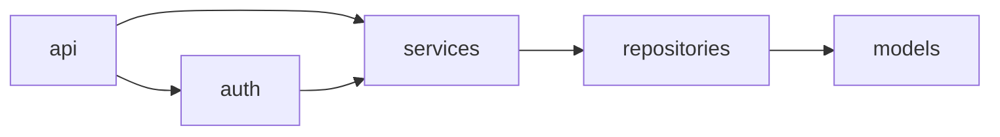
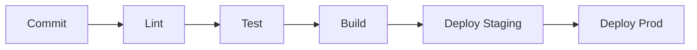

# Tech Due Diligence Review (Parallelized)

Perform a comprehensive technical due diligence review using Serena for semantic analysis and parallel sub-agents for faster review.

## Instructions

### Phase 1: Initial Discovery with Serena

Use Serena MCP for semantic codebase understanding:

1. **Activate the project**
   ```
   Call: mcp__serena__activate_project
   ```

2. **Check if onboarding was already performed**
   ```
   Call: mcp__serena__check_onboarding_performed
   ```

3. **If not onboarded, run onboarding**
   ```
   Call: mcp__serena__onboarding
   ```
   This will:
   - Identify project structure semantically
   - Detect tech stack via language servers
   - Map essential tasks (build, test, deploy)
   - Store knowledge in `.serena/memories/`

4. **Get symbols overview for architecture understanding**
   ```
   Call: mcp__serena__get_symbols_overview
   ```

5. **Read any existing Serena memories**
   ```
   Call: mcp__serena__read_memory (for each relevant memory file)
   ```

6. **Run `cloc .`** for lines-of-code statistics (Serena doesn't provide this). Install if not present:
   ```bash
   # Install cloc if missing
   which cloc >/dev/null 2>&1 || brew install cloc 2>/dev/null || npm install -g cloc 2>/dev/null || pip install cloc 2>/dev/null || sudo apt-get install -y cloc 2>/dev/null
   cloc . --exclude-dir=node_modules,.venv,venv,vendor,dist,build,.git,.history
   ```

7. **Run code duplication analysis.** Install the tool if not present, then run:
   ```bash
   # jscpd works for all languages (JS, TS, Python, Java, Go, Ruby, etc.)
   npm install -g jscpd 2>/dev/null
   jscpd --reporters json --gitignore --ignore ".history/**" .
   ```
   The `--gitignore` flag excludes node_modules/, dist/, build/, venv/ etc. The explicit `--ignore` catches .history/ in case it's not in .gitignore.

   Fallback if npm is unavailable:
   - `flay` for Ruby (`gem install flay 2>/dev/null && flay .`)
   - `pmd cpd` for Java (only if already installed)
   - If no tool can be installed, use `grep -rn` to identify obvious copy-paste patterns

   Record the **duplication percentage** (industry benchmark: ≤5% is good, >10% is concerning)

8. **Run static analysis for cyclomatic complexity.**

   **IMPORTANT: Always install the tool first if not present. These are lightweight analysis tools safe to install temporarily.**
   **IMPORTANT: Always exclude non-project files.** Use .gitignore-aware flags or explicit exclude patterns to avoid scanning `node_modules/`, `venv/`, `.venv/`, `vendor/`, `dist/`, `build/`, `__pycache__/`, `.git/`, and other generated/dependency directories.

   First, build an exclude pattern based on .gitignore and common defaults:
   ```bash
   # Detect directories to exclude (combine .gitignore + common defaults)
   EXCLUDE_DIRS="node_modules,.venv,venv,env,.env,vendor,dist,build,__pycache__,.git,.history,.mypy_cache,.pytest_cache,.tox,site-packages"
   ```

   Detect the primary language from cloc output, then install and run the matching tool:

   **Python:**
   ```bash
   pip install radon 2>/dev/null
   radon cc . -s -a -n C --exclude "$EXCLUDE_DIRS" --json > /tmp/radon-cc.json
   radon cc . -s -a -n C --exclude "$EXCLUDE_DIRS"  # Human-readable
   ```
   Record: average complexity, number of functions rated C/D/E/F, worst offenders with file:line

   **JavaScript/TypeScript:**
   ```bash
   npm install -g complexity-report 2>/dev/null
   # cr operates on specific dirs — point it at source, not root
   # Identify the source directory first (src/, lib/, app/, etc.)
   cr --format json src/ 2>/dev/null
   # Fallback if cr fails:
   npx eslint --no-eslintrc --rule 'complexity: [warn, 10]' --ext .js,.ts,.jsx,.tsx --ignore-pattern 'node_modules' --ignore-pattern 'dist' --ignore-pattern 'build' src/ 2>/dev/null
   ```

   **Go:**
   ```bash
   go install github.com/fzipp/gocyclo/cmd/gocyclo@latest 2>/dev/null
   # gocyclo ignores vendor/ by default; explicitly list source dirs if needed
   find . -name '*.go' -not -path './vendor/*' -not -path './.git/*' -not -path './.history/*' | xargs gocyclo -over 10
   ```

   **Java:**
   ```bash
   # PMD is larger — only use if already installed. It respects -d for source dirs.
   pmd check -d src -R category/java/design.xml/CyclomaticComplexity -f json 2>/dev/null
   ```

   **C# (.NET):**
   ```bash
   # Use JetBrains command-line tools (works without full IDE)
   dotnet tool install -g JetBrains.ReSharper.GlobalTools 2>/dev/null
   jb inspectcode *.sln --output=/tmp/resharper-report.xml --severity=WARNING 2>/dev/null
   # Parse the XML for complexity warnings

   # Alternative: dotnet-counters or built-in Roslyn analyzers
   # If a .sln or .csproj exists, check if analyzers are already configured:
   grep -r 'CA1502' . --include='*.editorconfig' --include='*.ruleset' 2>/dev/null
   # CA1502 = "Avoid excessive complexity" (Roslyn built-in)

   # Lightweight fallback if dotnet tools unavailable:
   # Count methods with high branch density
   find . -name '*.cs' -not -path '*/bin/*' -not -path '*/obj/*' -not -path '*/.history/*' | \
     xargs grep -c 'if \|else \|switch \|case \|while \|for \|foreach \|catch ' 2>/dev/null | \
     sort -t: -k2 -rn | head -20
   ```

   **If installation fails** (e.g. no pip/npm/go available, network issues, or permissions), note `CC_TOOL=heuristic` in the context file so agents fall back to heuristic analysis.

9. **Run dead code detection.** Install and run, excluding non-project files:

   **Python:**
   ```bash
   pip install vulture 2>/dev/null
   # vulture doesn't have --exclude glob, so pass explicit paths
   # First find all project .py files (excluding venv/deps)
   vulture . --min-confidence 80 --exclude venv,.venv,env,node_modules,__pycache__,.git,.history,dist,build,site-packages 2>/dev/null
   ```

   **TypeScript/JavaScript:**
   ```bash
   # knip uses project tsconfig/package.json — inherently scoped to project files
   npx knip 2>/dev/null || npx ts-prune 2>/dev/null
   ```

   **C# (.NET):**
   ```bash
   # If ReSharper CLI was installed in step 8, reuse its output — it includes dead code findings
   # (R# inspection IDs: UnusedMember.Global, UnusedMember.Local, UnusedType.Global)
   grep -E 'UnusedMember|UnusedType|UnusedAutoPropertyAccessor' /tmp/resharper-report.xml 2>/dev/null

   # Alternative: use Roslyn analyzers if configured in the project
   # IDE0051 = Remove unused private members
   # IDE0052 = Remove unread private members
   # CS0168 = Variable declared but never used
   dotnet build *.sln 2>&1 | grep -E 'IDE005[12]|CS0168|CS0219' 2>/dev/null
   ```

   If installation fails, note `DEAD_CODE_TOOL=unavailable` in the context file.

10. **Measure type coverage**, excluding non-project files:

    **Python (if mypy is in the project's dependencies):**
    ```bash
    mypy . --stats --exclude '(venv|\.venv|node_modules|__pycache__|\.git|\.history)' 2>/dev/null | tail -5
    ```
    Do NOT install mypy if it's not already a project dependency — it requires project-specific configuration.

    **TypeScript:**
    ```bash
    # Ratio of .ts/.tsx files to .js/.jsx files (excluding deps/build)
    echo "TS files:" && find . \( -name '*.ts' -o -name '*.tsx' \) -not -path '*/node_modules/*' -not -path '*/dist/*' -not -path '*/build/*' -not -path '*/.git/*' -not -path '*/.history/*' | wc -l
    echo "JS files:" && find . \( -name '*.js' -o -name '*.jsx' \) -not -path '*/node_modules/*' -not -path '*/dist/*' -not -path '*/build/*' -not -path '*/.git/*' -not -path '*/.history/*' | wc -l
    ```

    **Python (fallback if no mypy):**
    ```bash
    # Count files with type hints vs without (excluding venv/deps)
    echo "Files with type hints:" && grep -rl '-> \|: str\|: int\|: float\|: bool\|: list\|: dict\|: Optional\|: Union' --include='*.py' . | grep -v -E '(venv|\.venv|__pycache__|node_modules|site-packages|\.history)' | wc -l
    echo "Total Python files:" && find . -name '*.py' -not -path '*/venv/*' -not -path '*/.venv/*' -not -path '*/__pycache__/*' -not -path '*/site-packages/*' -not -path '*/.history/*' | wc -l
    ```

11. **Create the shared context file** at `.claude-review-context.md` combining:
   - Serena's onboarding insights and memories
   - LOC statistics from cloc
   - **Code duplication percentage** (from step 7)
   - **Cyclomatic complexity summary** (from step 8) — average CC, worst offenders, tool used
   - **Dead code candidates** (from step 9) — summary count and top items
   - **Type coverage stats** (from step 10)
   - Symbols overview
   - Project root path

### Phase 2: Parallel Sub-Agent Analysis

Launch ALL 6 sub-agents **in parallel** using the Task tool.

**IMPORTANT**:
- Use `subagent_type: "general-purpose"` for each agent
- Use `run_in_background: true` for parallel execution
- Launch all 6 agents in a **single message** with multiple Task tool calls

---

#### Agent 1: Code Quality Review

```
Task(
  subagent_type: "general-purpose",
  run_in_background: true,
  description: "Code quality review",
  prompt: """
You are a specialized code quality analyst. Perform a focused review of code quality aspects.

## Input
Read the shared context from `.claude-review-context.md` to understand the codebase structure.

## Serena Tools (Use These!)

Leverage Serena MCP for semantic code analysis:

| Tool | Use For |
|------|---------|
| `mcp__serena__get_symbols_overview` | Get module/class structure for organization analysis |
| `mcp__serena__find_file` | Find test files, config files |
| `mcp__serena__search_for_pattern` | Search for code patterns |
| `mcp__serena__list_dir` | Explore directory structure |

Use these alongside traditional tools like `jscpd` for duplication detection.

## Tasks

### 1. Code Duplication Analysis (Copy-Paste Detection)
Run `jscpd . --reporters console` (or use the duplication data from `.claude-review-context.md` if already calculated) and document:
- Overall duplication percentage
- **Assessment vs. Industry Benchmark:**
  - ≤5%: ✓ Good - Within industry standard
  - 5-10%: ⚠ Elevated - Above benchmark, refactoring recommended
  - >10%: ✗ High - Significant technical debt
- Top 5 worst duplicated code blocks (with file paths and line numbers)
- Patterns in what's being duplicated
- Recommended refactoring approach

### 2. Structure & Organization
Analyze and document:
- Directory structure clarity (is it intuitive?)
- Separation of concerns (are layers/modules well-separated?)
- Naming conventions (files, functions, variables - are they consistent?)
- Module/package organization

### 3. Code Health Indicators
Check for and document:
- **Linting**: Presence of .eslintrc, .pylintrc, .rubocop.yml, etc.
- **Formatting**: Presence of .prettierrc, .editorconfig, black.toml, etc.
- **Type Safety**: TypeScript usage, Python type hints, Go interfaces, etc.
- **Documentation**: README quality, inline comments, API docs, docstrings

### 4. Testing Assessment
Analyze:
- Test file locations and naming patterns
- Estimated test coverage (ratio of test files to source files)
- Types of tests present (unit, integration, e2e)
- Test framework(s) used
- Presence of test configuration (jest.config, pytest.ini, etc.)
- CI test automation (check CI configs)

### 5. Cyclomatic Complexity (Measured)
Read the cyclomatic complexity data from `.claude-review-context.md` (collected in Phase 1 using radon/eslint/gocyclo).
If tool-measured data is available:
- Report the **average cyclomatic complexity** score
- List all functions/methods rated **C or worse** (CC ≥ 11) with file:line
- Assess against industry benchmarks:
  - A/B (CC 1-10): ✓ Good
  - C (CC 11-15): ⚠ Moderate — consider refactoring
  - D (CC 16-25): ✗ High — refactoring recommended
  - E/F (CC 26+): ✗✗ Very High — refactoring critical
- For the top 5 worst offenders, use Serena's `find_symbol` with `include_body=True` to read the function and describe **why** it's complex (many branches? nested loops? state machine?)

If no tool data is available, fall back to heuristic analysis:
- Search for deeply nested code (>4 levels of indentation)
- Identify functions with many if/elif/else/case branches
- Flag functions with multiple return paths

### 6. Dead Code Detection
Read dead code results from `.claude-review-context.md` (collected in Phase 1 using vulture/ts-prune/knip).
If tool data is available, categorize findings:
- **Unused functions/methods** (high confidence)
- **Unused imports** (high confidence)
- **Unused variables/constants** (medium confidence)
- **Unreachable code paths** (if detected)

If no tool data, use Serena's `find_referencing_symbols` on suspicious symbols (e.g. functions in utility files) to check if they're actually called.

### 7. Type Safety Coverage
Read type coverage data from `.claude-review-context.md`.
- Report the ratio of typed vs untyped files
- Identify areas with weak typing (e.g. `any` usage in TypeScript, missing type hints in Python)
- Search for `# type: ignore`, `@ts-ignore`, `@ts-expect-error` — count and sample

### 8. Hardcoded Values & Magic Numbers
Use `mcp__serena__search_for_pattern` to find values that should be extracted to configuration files, environment variables, or named constants.

**Search for these patterns:**

| Category | Search patterns | Example bad code |
|----------|----------------|-----------------|
| Magic numbers | Numeric literals in conditionals/assignments (excluding 0, 1, -1, common HTTP status codes in test files) | `if retries > 3`, `timeout = 30000`, `max_size = 1048576` |
| Hardcoded URLs | `http://`, `https://`, `ws://`, `wss://` in source code (not in config/env files) | `fetch('https://api.example.com/v2/users')` |
| Hardcoded hosts/ports | `localhost`, `127.0.0.1`, `0.0.0.0`, port numbers like `:5432`, `:6379`, `:3306`, `:8080` | `redis://127.0.0.1:6379` |
| Hardcoded file paths | Absolute paths in source code | `open('/var/log/app.log')`, `Path('/etc/config')` |
| Hardcoded email/contact | Email addresses, phone patterns in source (not in test fixtures) | `send_to('admin@company.com')` |
| Hardcoded business rules | Domain-specific thresholds, rates, limits | `if age >= 18`, `tax_rate = 0.19`, `discount = 0.15` |
| Environment-specific values | Dev/staging/prod URLs, database names, bucket names in source | `bucket = 'my-app-prod-uploads'` |

**How to search efficiently:**
```
# URLs in source files (exclude config, .env, tests, docs)
search_for_pattern: "https?://" in src/ or app/ or lib/

# Magic numbers in conditionals
search_for_pattern: "if.*[><=!]=?\s*[2-9]\d{0,4}\b" in src/
search_for_pattern: "timeout.*=\s*\d{3,}" in src/

# Hardcoded hosts
search_for_pattern: "localhost|127\.0\.0\.1|0\.0\.0\.0" in src/

# Hardcoded file paths
search_for_pattern: "(/var/|/tmp/|/etc/|/opt/|C:\\\\)" in src/
```

**Exclude from findings:**
- Constants already defined in dedicated config/constants files (this is the correct pattern)
- Test fixtures and test data
- Documentation and comments
- Default values in config schemas (e.g. `DEFAULT_TIMEOUT = 30` in a settings file is fine)

**Classify each finding:**
- **Config value**: Should come from env var or config file (URLs, hosts, credentials)
- **Named constant**: Should be a named constant in a constants module (magic numbers, business rules)
- **Already OK**: Value is in the right place but could use a better name

### 9. Code Smells
Identify specific examples of:
- Very long files (>500 lines) - list top 5
- Very long functions (>100 lines) - list examples
- Deep nesting (>4 levels)
- God classes/modules
- Dead code indicators

## Output Format

Write your findings to `.claude-review-code-quality.md` with this structure:

```markdown
# Code Quality Assessment

## Cyclomatic Complexity (Measured)
- **Tool used:** [radon/eslint/gocyclo/heuristic]
- **Average complexity:** X.X
- **Assessment:** [✓ Good (avg ≤ 5) / ⚠ Moderate (avg 5-10) / ✗ High (avg > 10)]
- **Functions rated C or worse (CC ≥ 11):** X functions
- **Worst offenders:**

| Function | Location | CC Score | Rating | Root Cause |
|----------|----------|----------|--------|------------|
| `process_order` | `src/orders.py:150` | 28 | E | Nested conditionals for shipping rules |
| ... | ... | ... | ... | ... |

- **Recommended refactoring:** [Specific suggestions per function]

## Dead Code
- **Tool used:** [vulture/ts-prune/knip/manual]
- **Unused functions:** X found
- **Unused imports:** X found
- **Estimated dead code:** ~X lines
- **Top candidates for removal:**
  1. `path/file.py:func_name` — no references found
  ...

## Type Safety
- **Typed files:** X% of codebase
- **Type ignore directives:** X occurrences
- **Weakly typed areas:** [list]

## Hardcoded Values & Magic Numbers

### Summary
- **Hardcoded URLs/hosts:** X found
- **Magic numbers:** X found
- **Hardcoded business rules:** X found
- **Assessment:** [✓ Well-configured / ⚠ Some hardcoding / ✗ Significant hardcoding]

### Findings
| Category | Location | Value | Recommendation |
|----------|----------|-------|----------------|
| Hardcoded URL | `src/api/client.ts:15` | `https://api.prod.example.com` | Move to env var `API_BASE_URL` |
| Magic number | `src/services/retry.py:30` | `timeout = 30000` | Extract to `settings.RETRY_TIMEOUT_MS` |
| Business rule | `src/checkout/tax.py:45` | `rate = 0.19` | Move to config or database |
| Hardcoded host | `src/cache.py:10` | `redis://localhost:6379` | Move to env var `REDIS_URL` |
| ... | ... | ... | ... |

### Positive Patterns
[List any good config management patterns already in use, e.g. "All DB config comes from env vars via `settings.py`"]

## Duplication Analysis (Copy-Paste)
- **Overall duplication:** X.X%
- **Industry benchmark:** ≤5%
- **Assessment:** [✓ Good / ⚠ Elevated / ✗ High]
- **Worst offenders:**
  1. `path/file1.ts:10-50` duplicates `path/file2.ts:20-60` (40 lines)
  ...
- **Recommended actions:** [Refactoring suggestions]

## Structure & Organization
### Directory Structure
[Assessment with specific observations]

### Separation of Concerns
[Assessment]

### Naming Conventions
[Assessment with examples of good/bad patterns]

## Code Health Indicators
| Indicator | Status | Details |
|-----------|--------|---------|
| Linting | ✅/⚠️/❌ | ... |
| Formatting | ✅/⚠️/❌ | ... |
| Type Safety | ✅/⚠️/❌ | ... |
| Documentation | ✅/⚠️/❌ | ... |

## Testing
- Coverage estimate: X%
- Test frameworks: [list]
- Test types present: [unit/integration/e2e]
- Notable gaps: [list]

## Code Smells Identified
### Long Files
1. `path/file.ts` - 1200 lines
...

### Other Issues
[List with file paths and line numbers]

## Summary
- **Strengths**: [bullet points]
- **Concerns**: [bullet points]
- **Risk Level**: Low/Medium/High
```

Be specific - always include file paths and line numbers for findings.
"""
)
```

---

#### Agent 2: Security Review

```
Task(
  subagent_type: "general-purpose",
  run_in_background: true,
  description: "Security review",
  prompt: """
You are a specialized security analyst. Perform a focused security assessment of the codebase.

## Input
Read the shared context from `.claude-review-context.md` to understand the codebase structure.

## Serena Tools (Use These!)

Leverage Serena MCP for semantic code searching:

| Tool | Use For |
|------|---------|
| `mcp__serena__search_for_pattern` | Search for security patterns (auth, crypto, eval, etc.) |
| `mcp__serena__find_symbol` | Find auth/security class definitions |
| `mcp__serena__find_file` | Find config files, .env files |

Use `mcp__serena__search_for_pattern` to find security-relevant code like:
- `password`, `secret`, `api_key`, `token`
- `eval(`, `exec(`, `subprocess`
- Authentication/authorization decorators or middleware

## Tasks

### 1. Authentication & Authorization
Analyze:
- Authentication mechanism (JWT, sessions, OAuth, API keys, etc.)
- Where auth logic lives (files and line numbers)
- Authorization/RBAC implementation
- Session management approach
- Password handling (hashing algorithms used)

### 2. Secrets Management
Search for and document:
- Hardcoded secrets (API keys, passwords, tokens in code)
- `.env` files committed to repo (check .gitignore)
- Secrets in config files
- Vault/secrets manager integration
- Environment variable usage patterns

Use patterns like:
- `password`, `secret`, `api_key`, `token`, `credential`
- Base64-encoded strings that look like secrets
- Connection strings with credentials

### 3. Input Validation
Analyze:
- User input validation patterns (or lack thereof)
- SQL query construction (parameterized vs string concatenation)
- Command execution with user input
- File path handling with user input
- HTML/template rendering (XSS risks)

### 4. Dependency Security
Check:
- Presence of `npm audit`, `pip-audit`, `cargo audit` in CI
- Lock file presence and freshness
- Known vulnerable packages (if audit tools available)

### 5. Security Anti-Patterns
Look for:
- `eval()` or equivalent dynamic code execution
- Disabled SSL verification
- Weak cryptography (MD5, SHA1 for security purposes)
- CORS misconfiguration (`*` origins)
- Debug modes enabled in production configs
- Sensitive data in logs
- Missing rate limiting
- Missing CSRF protection

### 6. Data Protection
Assess:
- PII handling patterns
- Data encryption at rest
- Data encryption in transit (HTTPS enforcement)
- Sensitive data exposure in APIs

## Output Format

Write your findings to `.claude-review-security.md` with this structure:

```markdown
# Security Assessment

## Authentication & Authorization
### Mechanism
[Description of auth approach]

### Implementation Details
- Auth logic: `path/to/auth.ts:50-150`
- [Other relevant files]

### Concerns
[List any issues found]

## Secrets Management
### Findings
| Type | Location | Severity | Details |
|------|----------|----------|---------|
| Hardcoded API key | `src/config.ts:25` | HIGH | AWS key exposed |
| ... | ... | ... | ... |

### Recommendations
[List]

## Input Validation
### SQL Injection Risks
[Findings with file paths]

### XSS Risks
[Findings with file paths]

### Command Injection Risks
[Findings with file paths]

## Security Anti-Patterns Found
| Pattern | Location | Risk Level |
|---------|----------|------------|
| eval() usage | `src/parser.js:120` | HIGH |
| ... | ... | ... |

## Positive Security Practices
[List good practices observed]

## Risk Summary
| Category | Risk Level | Key Concerns |
|----------|------------|--------------|
| Authentication | Low/Med/High | ... |
| Secrets | Low/Med/High | ... |
| Input Validation | Low/Med/High | ... |
| Dependencies | Low/Med/High | ... |

## Critical Findings (Requires Immediate Action)
1. [If any]

## Summary
- **Strengths**: [bullet points]
- **Concerns**: [bullet points]
- **Overall Security Risk**: Low/Medium/High
```

**IMPORTANT**: Be specific with file paths and line numbers. For actual secrets found, redact the values but note the location.
"""
)
```

---

#### Agent 3: Architecture Review

```
Task(
  subagent_type: "general-purpose",
  run_in_background: true,
  description: "Architecture review",
  prompt: """
You are a specialized software architect. Perform a focused architecture analysis of the codebase.

## Input
Read the shared context from `.claude-review-context.md` to understand the codebase structure.

## Serena Tools (Use These!)

Leverage Serena MCP for semantic code understanding:

| Tool | Use For |
|------|---------|
| `mcp__serena__get_symbols_overview` | Get all classes, functions, modules - **use this first!** |
| `mcp__serena__find_symbol` | Find specific class/function definitions |
| `mcp__serena__search_for_pattern` | Search for architectural patterns |
| `mcp__serena__list_dir` | Explore directory structure |

**Start by calling `mcp__serena__get_symbols_overview`** to get the full symbol map of the codebase.

## Tasks

### 1. Architecture Pattern Identification
Determine:
- Overall pattern: Monolith, Microservices, Serverless, Modular Monolith, etc.
- Frontend architecture: SPA, SSR, Static, Hybrid
- Backend architecture: Layered, Hexagonal, Clean Architecture, etc.
- Evidence supporting your assessment

### 2. Component/Module Structure
Map:
- Core modules/packages and their responsibilities
- Boundaries between components
- Shared code locations
- Entry points (main files, handlers, controllers)

### 3. Data Flow Analysis
Trace:
- Request/response flow through the system
- Data transformation points
- State management approach
- Event/message flows (if applicable)

### 4. External Integrations
Document:
- Third-party APIs consumed
- Databases and data stores
- Message queues/event buses
- External services (auth providers, payment, email, etc.)
- Integration patterns used (REST, GraphQL, gRPC, webhooks)

### 5. Layer Boundary Violations (Architectural Integrity)
This is a critical analysis. Detect code that violates the intended architectural layering.

**Step 1: Identify the intended architecture layers** based on directory structure and framework conventions.
Common patterns to detect:

| Framework | Expected Layers | Forbidden Dependencies |
|-----------|----------------|----------------------|
| Django | views → services → models | views must NOT contain ORM queries directly (filter/exclude/annotate/aggregate), business logic (calculations, validation beyond form), or direct model.save() calls |
| Rails | controllers → services → models | controllers must NOT contain ActiveRecord queries, business logic |
| Express/Fastify | routes/controllers → services → repositories → models | routes must NOT import database clients or ORMs directly |
| React/Vue/Angular | components → hooks/composables → services → API | components must NOT contain fetch/axios calls, direct API URLs, or complex business logic |
| Spring | controllers → services → repositories | controllers must NOT have @Repository or EntityManager usage |
| ASP.NET MVC/API | Controllers → Services → Repositories/DbContext | Controllers must NOT use DbContext/DbSet directly, must NOT contain LINQ queries against DB, must NOT have business logic beyond request/response mapping |
| Blazor | Components/Pages → Services → Data Access | Components must NOT inject DbContext, must NOT contain business rules |
| FastAPI | routers → services → repositories | routers must NOT import SQLAlchemy Session or run queries |
| Clean/Hexagonal | adapters → use cases → entities | entities must NOT import from adapters, use cases must NOT import from infrastructure |

**Step 2: For each identified layer, use `mcp__serena__search_for_pattern` to find violations.**

Example searches for a Django project:
```
# Views importing ORM query methods directly
search in views/ for: \.filter\(|\.exclude\(|\.annotate\(|\.aggregate\(|\.raw\(
# Views doing direct model saves
search in views/ for: \.save\(\)|\.delete\(\)|\.bulk_create\(
# Templates containing business logic
search in templates/ for: \{\%.*if.*\.count\(|forloop|add:|multiply:
```

Example searches for a React project:
```
# Components making direct API calls
search in components/ for: fetch\(|axios\.|\.get\(.*api|\.post\(.*api
# Components with SQL or ORM usage (if full-stack)
search in components/ for: query\(|SELECT|INSERT|UPDATE
# Business logic in view layer
search in components/ for: \.reduce\(|\.filter\(.*&&.*\.filter\(  (chained complex transforms)
```

Example searches for an ASP.NET project:
```
# Controllers using DbContext directly
search in Controllers/ for: DbContext|DbSet|\.Include\(|\.Where\(|\.FirstOrDefault\(|\.ToList\(|\.SaveChanges\(
# Controllers with LINQ query syntax
search in Controllers/ for: from\s+\w+\s+in\s+|\.Select\(|\.GroupBy\(|\.OrderBy\(
# Razor views/pages containing business logic
search in Views/ or Pages/ for: @\{.*if.*\.|@for.*\.Count|\.Where\(|\.Any\(
# Data access outside repository/data layer
search in Services/ for: SqlConnection|SqlCommand|ExecuteNonQuery|ExecuteReader
```

**Step 3: Classify each violation by severity:**
- **Critical**: Data access in presentation layer, business logic in templates
- **High**: Service logic in controllers/routes, direct DB access skipping repository layer
- **Medium**: Minor convenience shortcuts that bypass a layer
- **Low**: Debatable cases where pragmatism may justify the shortcut

### 6. Dependency Graph
Analyze:
- Inter-module dependencies
- Circular dependency risks (use `mcp__serena__find_referencing_symbols` to verify bidirectional deps)
- Coupling between components
- Abstraction layers

### 7. Scalability Design
Assess:
- Stateless vs stateful components
- Caching strategy
- Database access patterns
- Horizontal scaling readiness
- Bottleneck indicators

## Output Format

Write your findings to `.claude-review-architecture.md` with this structure:

```markdown
# Architecture Overview

## Architecture Pattern
**Primary Pattern**: [e.g., Modular Monolith]
**Evidence**: [Why you concluded this]

### Frontend
- Pattern: [SPA/SSR/etc.]
- Framework: [React/Vue/etc.]
- Key entry points: [file paths]

### Backend
- Pattern: [Layered/Hexagonal/etc.]
- Framework: [Express/FastAPI/etc.]
- Key entry points: [file paths]

## Component Structure

### Core Modules
| Module | Path | Responsibility |
|--------|------|----------------|
| Auth | `src/auth/` | User authentication and sessions |
| ... | ... | ... |

### Component Diagram


## Data Flow

### Request Lifecycle


### State Management
[Description of how state is managed]

## External Integrations
| Service | Type | Purpose | Location |
|---------|------|---------|----------|
| Stripe | REST API | Payments | `src/payments/stripe.ts` |
| ... | ... | ... | ... |

## Dependency Analysis

### Inter-Module Dependencies


### Coupling Assessment
- Tight coupling: [list problematic areas]
- Well-decoupled: [list good examples]

## Layer Boundary Violations

### Intended Architecture Layers
```
[Presentation] → [Application/Service] → [Domain/Business] → [Infrastructure/Data]
```
[Describe the intended layer structure for this specific project]

### Violations Found
| Severity | Location | Violation | Expected |
|----------|----------|-----------|----------|
| CRITICAL | `views/orders.py:45` | ORM query `Order.objects.filter()` in view | Should be in service/repository layer |
| HIGH | `components/Cart.tsx:120` | Direct `fetch('/api/...')` in component | Should use service/hook layer |
| MEDIUM | `controllers/user.go:80` | Validation logic in controller | Should be in service or domain layer |
| ... | ... | ... | ... |

### Violation Summary
- **Critical:** X violations (data access in presentation)
- **High:** X violations (skipped layers)
- **Medium:** X violations (minor shortcuts)
- **Assessment:** [✓ Clean architecture / ⚠ Some leakage / ✗ Layers not enforced]

### Recommendations
[Specific refactoring suggestions to restore layer integrity]

## Scalability Assessment
| Aspect | Status | Notes |
|--------|--------|-------|
| Stateless services | ✅/⚠️/❌ | ... |
| Database patterns | ✅/⚠️/❌ | ... |
| Caching | ✅/⚠️/❌ | ... |
| Horizontal scaling | ✅/⚠️/❌ | ... |

## Summary
- **Strengths**: [bullet points]
- **Concerns**: [bullet points]
- **Architecture Risk**: Low/Medium/High
```

Include Mermaid diagrams to visualize architecture, data flow, and dependencies.
"""
)
```

---

#### Agent 4: Dependencies Review

```
Task(
  subagent_type: "general-purpose",
  run_in_background: true,
  description: "Dependencies review",
  prompt: """
You are a specialized dependency analyst. Perform a focused review of project dependencies.

## Input
Read the shared context from `.claude-review-context.md` to understand the codebase structure.

## Tasks

### 1. Dependency Inventory
For each package manager found (npm, pip, cargo, go mod, etc.):
- Count direct dependencies
- Count dev dependencies
- Identify the dependency manifest files

### 2. Dependency Health
Analyze:
- Last update date of lock files
- Presence of outdated packages (check for update commands in CI)
- Deprecated packages (look for deprecation warnings in configs)
- Abandoned packages (if detectable)

### 3. Security Vulnerabilities
Check for:
- Security audit configurations (npm audit, pip-audit, etc.)
- Known vulnerability scanning in CI
- Dependabot/Renovate configuration
- SBOM (Software Bill of Materials) generation

Run if available:
- `npm audit --json` (for Node.js)
- `pip-audit` (for Python)
- `cargo audit` (for Rust)
- Check for existing audit reports

### 4. Vendor Lock-in Assessment
Evaluate:
- Cloud provider-specific SDKs (AWS, GCP, Azure)
- Proprietary service dependencies
- Framework coupling level
- Ease of replacing key dependencies

### 5. Dependency Quality
For major dependencies, assess:
- Maintenance status (active/maintenance/deprecated)
- Community size and support
- License compatibility
- Alternative options

### 6. Bundle/Package Size (for frontend)
If applicable:
- Large dependencies
- Tree-shaking effectiveness
- Bundle analysis configs present

## Output Format

Write your findings to `.claude-review-dependencies.md` with this structure:

```markdown
# Dependencies Assessment

## Inventory Summary
| Package Manager | Manifest | Direct Deps | Dev Deps | Lock File |
|-----------------|----------|-------------|----------|-----------|
| npm | package.json | 45 | 23 | ✅ package-lock.json |
| pip | requirements.txt | 30 | 10 | ❌ missing |
| ... | ... | ... | ... | ... |

## Dependency Health

### Update Status
- Lock file last modified: [date]
- Automated updates: [Dependabot/Renovate/None]
- Update policy: [if documented]

### Potentially Outdated
| Package | Current | Latest | Risk |
|---------|---------|--------|------|
| react | 17.0.2 | 18.2.0 | Medium |
| ... | ... | ... | ... |

### Deprecated/Abandoned
| Package | Status | Recommendation |
|---------|--------|----------------|
| request | Deprecated | Use axios or fetch |
| ... | ... | ... |

## Security Analysis

### Vulnerability Scanning
- npm audit: [Configured/Not configured]
- Dependabot: [Enabled/Disabled]
- CI security checks: [Yes/No]

### Known Vulnerabilities
| Severity | Package | Vulnerability | Fix Available |
|----------|---------|---------------|---------------|
| HIGH | lodash@4.17.15 | Prototype pollution | Yes (4.17.21) |
| ... | ... | ... | ... |

### Vulnerability Summary
- Critical: X
- High: X
- Medium: X
- Low: X

## Vendor Lock-in Assessment
| Dependency | Type | Lock-in Risk | Migration Effort |
|------------|------|--------------|------------------|
| @aws-sdk/* | Cloud SDK | High | High |
| prisma | ORM | Medium | Medium |
| ... | ... | ... | ... |

### Lock-in Summary
- Cloud provider dependencies: [list]
- Proprietary services: [list]
- Mitigation strategies: [if present]

## License Analysis
| License | Count | Packages | Commercial Risk |
|---------|-------|----------|-----------------|
| MIT | 120 | [list if few] | Low |
| GPL-3.0 | 2 | pkg1, pkg2 | High |
| ... | ... | ... | ... |

## Major Dependencies Review
| Package | Purpose | Maintenance | Alternatives |
|---------|---------|-------------|--------------|
| express | Web framework | Active | fastify, koa |
| ... | ... | ... | ... |

## Bundle Size (Frontend)
- Total bundle size: [if measurable]
- Largest dependencies: [list]
- Tree-shaking: [configured/not configured]

## Summary
- **Total Dependencies**: X direct, Y transitive
- **Security Status**: X vulnerabilities (Y critical)
- **Lock-in Risk**: Low/Medium/High
- **Strengths**: [bullet points]
- **Concerns**: [bullet points]
- **Overall Dependency Risk**: Low/Medium/High
```

Be specific about version numbers and provide actionable recommendations.
"""
)
```

---

#### Agent 5: DevOps Review

```
Task(
  subagent_type: "general-purpose",
  run_in_background: true,
  description: "DevOps review",
  prompt: """
You are a specialized DevOps engineer. Perform a focused review of CI/CD, infrastructure, and observability.

## Input
Read the shared context from `.claude-review-context.md` to understand the codebase structure.

## Tasks

### 1. CI/CD Pipeline Analysis
Look for and analyze:
- `.github/workflows/` (GitHub Actions)
- `.gitlab-ci.yml` (GitLab CI)
- `Jenkinsfile` (Jenkins)
- `.circleci/config.yml` (CircleCI)
- `azure-pipelines.yml` (Azure DevOps)
- `bitbucket-pipelines.yml` (Bitbucket)

Document:
- Pipeline stages (build, test, deploy)
- Test automation in CI
- Code quality gates (linting, type checking)
- Security scanning steps
- Deployment automation
- Environment management (dev, staging, prod)

### 2. Containerization
Look for:
- `Dockerfile` / `docker-compose.yml`
- Container build optimization (multi-stage, layer caching)
- Base image choices (official, version pinning)
- Security considerations (non-root user, minimal images)
- Kubernetes manifests (`k8s/`, `kubernetes/`, `*.yaml`)
- Helm charts (`charts/`, `helm/`)

### 3. Infrastructure as Code
Identify:
- Terraform (`.tf` files, `terraform/`)
- Pulumi (`Pulumi.yaml`)
- CloudFormation (`template.yaml`, `cloudformation/`)
- CDK (`cdk.json`)
- Ansible (`ansible/`, `playbooks/`)

Assess:
- IaC coverage
- State management approach
- Module organization
- Environment separation

### 4. Deployment Configuration
Analyze:
- Deployment strategy (rolling, blue-green, canary)
- Environment configuration management
- Feature flags system
- Rollback procedures (documented?)
- Database migration handling

### 5. Observability Stack

#### Logging
- Logging framework used
- Log levels and structure (JSON, plaintext)
- Log aggregation (ELK, Loki, CloudWatch, etc.)
- Sensitive data in logs?

#### Monitoring & Metrics
- Metrics collection (Prometheus, StatsD, CloudWatch)
- Custom metrics defined
- Dashboards (Grafana configs)
- SLIs/SLOs defined

#### Tracing
- Distributed tracing (OpenTelemetry, Jaeger, Zipkin)
- Trace context propagation

#### Alerting
- Alert definitions
- On-call configuration
- Runbooks present

### 6. Health & Reliability
Check for:
- Health check endpoints
- Readiness/liveness probes
- Graceful shutdown handling
- Circuit breakers
- Retry policies
- Timeout configurations

## Output Format

Write your findings to `.claude-review-devops.md` with this structure:

```markdown
# DevOps & Observability Assessment

## CI/CD Pipeline

### Pipeline Configuration
| Platform | Config File | Status |
|----------|-------------|--------|
| GitHub Actions | `.github/workflows/ci.yml` | ✅ Present |
| ... | ... | ... |

### Pipeline Stages


### Pipeline Quality
| Aspect | Status | Details |
|--------|--------|---------|
| Automated tests | ✅/⚠️/❌ | Jest, pytest in CI |
| Linting | ✅/⚠️/❌ | ESLint configured |
| Security scanning | ✅/⚠️/❌ | npm audit in pipeline |
| Type checking | ✅/⚠️/❌ | tsc --noEmit |
| Deployment automation | ✅/⚠️/❌ | ... |

## Containerization

### Docker
| File | Purpose | Quality |
|------|---------|---------|
| `Dockerfile` | Production build | ⚠️ Not multi-stage |
| `docker-compose.yml` | Local dev | ✅ Well configured |

### Container Best Practices
| Practice | Status | Notes |
|----------|--------|-------|
| Multi-stage builds | ✅/❌ | ... |
| Non-root user | ✅/❌ | ... |
| Version pinning | ✅/❌ | ... |
| .dockerignore | ✅/❌ | ... |

### Kubernetes
[If applicable: describe K8s setup, Helm charts, etc.]

## Infrastructure as Code

### IaC Coverage
| Tool | Location | Resources Managed |
|------|----------|-------------------|
| Terraform | `infra/terraform/` | AWS VPC, ECS, RDS |
| ... | ... | ... |

### IaC Quality
| Aspect | Status | Notes |
|--------|--------|-------|
| State management | ✅/⚠️/❌ | Remote state in S3 |
| Modules used | ✅/⚠️/❌ | Custom modules |
| Environment separation | ✅/⚠️/❌ | Workspaces |
| Secrets handling | ✅/⚠️/❌ | ... |

## Deployment

### Strategy
- **Type**: [Rolling/Blue-Green/Canary]
- **Automation Level**: [Manual/Semi-auto/Fully automated]
- **Rollback**: [Documented/Automated/None]

### Environment Management
| Environment | Config Location | Deployment |
|-------------|-----------------|------------|
| Development | `.env.development` | Manual |
| Staging | `.env.staging` | Auto on merge |
| Production | `.env.production` | Manual approval |

## Observability

### Logging
| Aspect | Implementation | Location |
|--------|----------------|----------|
| Framework | winston/pino/etc. | `src/logger.ts` |
| Format | JSON structured | ... |
| Aggregation | [ELK/CloudWatch/etc.] | ... |

### Monitoring
| Tool | Purpose | Config Location |
|------|---------|-----------------|
| Prometheus | Metrics | `prometheus.yml` |
| Grafana | Dashboards | `dashboards/` |
| ... | ... | ... |

### Alerting
- Alert definitions: [location or "Not found"]
- Runbooks: [location or "Not found"]
- On-call: [PagerDuty/OpsGenie/etc. or "Not configured"]

### Health Checks
| Endpoint | Type | Location |
|----------|------|----------|
| `/health` | Liveness | `src/routes/health.ts` |
| `/ready` | Readiness | ... |

## Reliability Patterns
| Pattern | Implemented | Location |
|---------|-------------|----------|
| Circuit breaker | ✅/❌ | ... |
| Retry with backoff | ✅/❌ | ... |
| Graceful shutdown | ✅/❌ | ... |
| Rate limiting | ✅/❌ | ... |

## Summary
- **CI/CD Maturity**: Low/Medium/High
- **Infrastructure Maturity**: Low/Medium/High
- **Observability Maturity**: Low/Medium/High
- **Strengths**: [bullet points]
- **Concerns**: [bullet points]
- **Overall DevOps Risk**: Low/Medium/High
```

Be specific with file paths and provide actionable improvement recommendations.
"""
)
```

---

#### Agent 6: Maintainability Review

```
Task(
  subagent_type: "general-purpose",
  run_in_background: true,
  description: "Maintainability review",
  prompt: """
You are a specialized software maintainability analyst. Perform a focused review of code maintainability and technical debt.

## Input
Read the shared context from `.claude-review-context.md` to understand the codebase structure.

## Serena Tools (Use These!)

Leverage Serena MCP for code analysis:

| Tool | Use For |
|------|---------|
| `mcp__serena__get_symbols_overview` | Find large modules, class counts per file |
| `mcp__serena__search_for_pattern` | Find TODO, FIXME, HACK comments |
| `mcp__serena__find_symbol` | Analyze specific complex functions |

Use `mcp__serena__search_for_pattern` to find:
- `TODO`, `FIXME`, `HACK`, `XXX` comments
- `@deprecated`, `# deprecated` markers
- `skip`, `xfail` in tests

## Tasks

### 1. Complexity Hotspots (Tool-Measured + Heuristic)
Read the cyclomatic complexity data from `.claude-review-context.md` (Phase 1 ran radon/eslint/gocyclo).

**If measured CC data is available:**
- List all functions with CC ≥ 11 (rated C or worse)
- For the top 10 worst offenders, use `mcp__serena__find_symbol` with `include_body=True` to read the function
- Classify the **root cause** of complexity for each:
  - `BRANCHING`: Too many if/elif/else/switch paths
  - `NESTING`: Deeply nested loops/conditionals (>3 levels)
  - `STATE_MACHINE`: Complex state transitions
  - `ERROR_HANDLING`: Excessive try/catch/finally branching
  - `MIXED_CONCERNS`: Function doing multiple unrelated things
- Suggest specific refactoring strategy per root cause (e.g. extract method, strategy pattern, early returns, guard clauses)

**Also check (regardless of tool availability):**
- Large file size (>500 lines)
- Large function/method size (>50 lines)
- High coupling (many imports/dependencies — count imports per file, flag files with >15 imports)

Provide specific file paths and line counts.

### 2. Technical Debt Indicators
Look for:
- TODO/FIXME/HACK/XXX comments (count and sample)
- Disabled tests (skip, xfail, etc.)
- Commented-out code blocks
- Workarounds with explanatory comments
- Version-specific hacks
- Deprecation warnings being suppressed

### 3. Code Patterns Analysis
Assess:
- Consistency of patterns across the codebase
- Adherence to framework conventions
- DRY violations (similar code in multiple places)
- Proper abstraction levels
- Error handling patterns (consistent or ad-hoc?)

### 4. Performance Concerns
Identify potential bottlenecks:
- N+1 query patterns in database access
- Synchronous operations that could be async
- Missing pagination in list operations
- Large data structures in memory
- Missing caching opportunities
- Inefficient algorithms (nested loops, repeated computations)

### 5. Bus Factor Assessment
Evaluate:
- Code ownership distribution (if git history available: `git shortlog -sn`)
- Documentation for critical systems
- Knowledge silos (complex areas with single contributor)
- Onboarding documentation
- Architecture decision records (ADRs)

### 6. Refactoring Opportunities
Identify:
- Clear refactoring candidates
- Modules that could be extracted
- Dead code that can be removed
- Opportunities to improve type safety
- Areas needing better test coverage

### 7. Evolution Indicators
Check:
- Age of different parts of the codebase
- Patterns of change (what changes frequently?)
- Migration status (partial upgrades, mixed patterns)
- Legacy vs modern code sections

## Output Format

Write your findings to `.claude-review-maintainability.md` with this structure:

```markdown
# Maintainability Assessment

## Complexity Hotspots

### Large Files (>500 lines)
| File | Lines | Concern |
|------|-------|---------|
| `src/services/order.ts` | 1,250 | God class, handles too much |
| ... | ... | ... |

### Complex Functions (Measured Cyclomatic Complexity)
| Function | Location | Lines | CC Score | Root Cause | Refactoring Strategy |
|----------|----------|-------|----------|------------|---------------------|
| `processOrder` | `src/services/order.ts:150` | 180 | 28 (E) | BRANCHING + MIXED_CONCERNS | Extract shipping/payment/validation into separate methods |
| `parseConfig` | `src/config.py:30` | 95 | 15 (C) | NESTING | Use early returns, flatten conditionals |
| ... | ... | ... | ... | ... | ... |

Root cause categories: BRANCHING, NESTING, STATE_MACHINE, ERROR_HANDLING, MIXED_CONCERNS

### High Coupling
| Module | Dependencies | Risk |
|--------|--------------|------|
| `src/core/` | Imports from 15 modules | High |
| ... | ... | ... |

## Technical Debt

### Debt Indicators Summary
| Indicator | Count | Samples |
|-----------|-------|---------|
| TODO comments | 45 | "TODO: fix this hack" in `src/api.ts:50` |
| FIXME comments | 12 | ... |
| Commented code | 8 blocks | `src/legacy/old.ts:100-150` |
| Disabled tests | 5 | ... |

### Significant Debt Items
1. **[Location]**: [Description of debt and impact]
2. ...

### Estimated Debt Level
- **Critical debt** (blocking future work): [list]
- **High debt** (slowing development): [list]
- **Medium debt** (minor friction): [list]

## Code Patterns

### Consistency Assessment
| Aspect | Status | Notes |
|--------|--------|-------|
| Error handling | ⚠️ Inconsistent | Mix of try/catch and .catch() |
| Async patterns | ✅ Consistent | async/await throughout |
| Naming conventions | ⚠️ Inconsistent | camelCase vs snake_case |
| File organization | ✅ Consistent | Feature-based structure |

### Pattern Violations
[List specific examples with file paths]

## Performance Concerns

### Database
| Issue | Location | Impact |
|-------|----------|--------|
| N+1 query | `src/repos/users.ts:45` | High |
| Missing index hint | `src/repos/orders.ts:80` | Medium |
| ... | ... | ... |

### Application
| Issue | Location | Impact |
|-------|----------|--------|
| Sync file read | `src/utils/config.ts:20` | Medium |
| No pagination | `src/api/list.ts:30` | High |
| ... | ... | ... |

### Caching
- Current caching: [describe what's cached]
- Missing caching: [opportunities identified]

## Bus Factor

### Code Ownership (if git available)
```
Top Contributors:
1. developer1 - 60% of commits
2. developer2 - 25% of commits
3. developer3 - 15% of commits
```

### Knowledge Silos
| Area | Primary Owner | Risk | Documentation |
|------|---------------|------|---------------|
| Payment system | developer1 | High | Minimal |
| Auth module | developer2 | Medium | Good |
| ... | ... | ... | ... |

### Documentation Status
| Doc Type | Status | Location |
|----------|--------|----------|
| README | ✅ Present | `/README.md` |
| API docs | ⚠️ Outdated | `/docs/api.md` |
| ADRs | ❌ Missing | - |
| Onboarding | ❌ Missing | - |

## Refactoring Opportunities

### High Priority
1. **[Target]**: [Current state] → [Proposed change] | Impact: [High/Med/Low]
2. ...

### Medium Priority
1. ...

### Dead Code Candidates
| Location | Type | Confidence |
|----------|------|------------|
| `src/legacy/old-api.ts` | Entire file | High |
| `src/utils/helpers.ts:50-80` | Unused functions | Medium |
| ... | ... | ... |

## Evolution Status

### Codebase Age Distribution
- Modern patterns (< 1 year): X%
- Mature code (1-3 years): X%
- Legacy code (> 3 years): X%

### Migration Status
| Migration | Status | Notes |
|-----------|--------|-------|
| React class → hooks | 70% complete | `src/components/old/` pending |
| JavaScript → TypeScript | 90% complete | ... |
| ... | ... | ... |

## Summary

### Maintainability Score: X/10

### Key Metrics
| Metric | Value | Assessment |
|--------|-------|------------|
| Complexity hotspots | X files | ⚠️ |
| Technical debt items | X | ⚠️ |
| Bus factor | X people | ✅/⚠️/❌ |
| Documentation coverage | X% | ✅/⚠️/❌ |

### Strengths
- [bullet points]

### Concerns
- [bullet points]

### Overall Maintainability Risk: Low/Medium/High
```

Focus on actionable findings with specific file paths and concrete improvement suggestions.
"""
)
```

---

### Phase 3: Aggregation

After all sub-agents complete:

1. **Read all partial reports**:
   - `.claude-review-code-quality.md`
   - `.claude-review-security.md`
   - `.claude-review-architecture.md`
   - `.claude-review-dependencies.md`
   - `.claude-review-devops.md`
   - `.claude-review-maintainability.md`

2. **Synthesize the final report** following the template below

3. **Write key findings to Serena memory** for future reference:
   ```
   Call: mcp__serena__write_memory
   File: tech-dd-summary.md
   Content: [Executive summary and key risks]
   ```

4. **Clean up** temporary files (context and partial reports)

5. **Output** the final report to `tech-dd-report.md`

---

## Final Report Template

### Management Summary

> **This section goes at the very top of the report for executive stakeholders.**

| Metric | Value | Assessment |
|--------|-------|------------|
| **Overall Rating** | ★★★☆☆ (X/5) | [Good/Acceptable/Needs Improvement/Critical] |
| **Lines of Code** | X,XXX | [Small/Medium/Large/Enterprise] |
| **Code Duplication** | X.X% | [✓ Good (≤5%) / ⚠ Elevated (5-10%) / ✗ High (>10%)] |
| **Avg Cyclomatic Complexity** | X.X | [✓ Good (≤5) / ⚠ Moderate (5-10) / ✗ High (>10)] |
| **High-Complexity Functions** | X (CC ≥ 11) | [Count of functions rated C/D/E/F] |
| **Layer Violations** | X critical, Y high | [Architectural integrity issues] |
| **Dead Code** | ~X lines | [Estimated removable code] |
| **Critical Risks** | X | [List count] |
| **Security Issues** | X | [List count by severity] |

**Bottom Line:** [1-2 sentence verdict on whether this codebase is suitable for acquisition/investment/continued development. Be direct.]

**Key Strengths:** [Bullet list of 2-3 main positives]

**Key Risks:** [Bullet list of 2-3 main concerns with business impact]

**Recommended Action:** [Proceed / Proceed with caution / Significant remediation needed / Do not proceed]

---

### Rating Scale Reference

| Rating | Stars | Meaning |
|--------|-------|---------|
| **5** | ★★★★★ | Excellent - Production-ready, well-maintained, minimal technical debt |
| **4** | ★★★★☆ | Good - Solid foundation with minor issues, low risk |
| **3** | ★★★☆☆ | Acceptable - Functional but has notable technical debt or gaps |
| **2** | ★★☆☆☆ | Below Average - Significant issues requiring substantial remediation |
| **1** | ★☆☆☆☆ | Poor - Critical issues, high risk, major investment needed |

---

### 1. Executive Summary
- Project name and purpose (from Serena onboarding)
- Codebase size (from cloc: total files, lines of code by language)
- Technology stack overview (from Serena)
- Overall health rating (1-5 stars) - use rating scale above
- Top 3-5 risks/concerns (synthesized from all sub-agents)
- Top 3-5 strengths

### 2. Technology Stack
- Languages and versions
- Frameworks and libraries (with versions where detectable)
- Databases and data stores
- External services and APIs
- Build tools and package managers

### 3. Architecture Overview
(From review-architecture agent + Serena symbols)
- High-level architecture pattern
- Component/module structure
- Data flow (include Mermaid diagram)
- External dependencies and integrations
- **Layer boundary violations** (count by severity, worst offenders with file:line)

### 4. Code Quality Assessment
(From review-code-quality agent)
#### 4.1 Cyclomatic Complexity (Measured)
- Tool used, average CC, functions rated C or worse, worst offenders with root cause analysis
#### 4.2 Structure & Organization
#### 4.3 Code Health Metrics (Dead Code, Type Coverage)
#### 4.4 Code Duplication (Copy-Paste Analysis)
- **Duplication Percentage:** X.X%
- **Industry Benchmark:** ≤5% is considered good
- **Assessment:** [✓ Within benchmark / ⚠ Above benchmark / ✗ Significantly above benchmark]
- **Hotspots:** List files/modules with highest duplication
- **Impact:** Technical debt implications and refactoring recommendations

#### 4.5 Testing

### 5. Dependencies
(From review-dependencies agent)
- Direct dependency count
- Outdated or deprecated packages
- Security vulnerabilities
- Vendor lock-in risks

### 6. Security Assessment
(From review-security agent)
- Authentication/Authorization approach
- Secrets management
- Input validation patterns
- Security anti-patterns observed

### 7. Operational Readiness
(From review-devops agent)
#### 7.1 DevOps & CI/CD
#### 7.2 Observability

### 8. Maintainability & Scalability
(From review-maintainability agent)
- Code complexity hotspots
- Performance bottlenecks
- Technical debt indicators
- Bus factor concerns

### 9. Risk Register

| Risk | Impact | Likelihood | Mitigation Recommendation |
|------|--------|------------|---------------------------|
| ...  | H/M/L  | H/M/L      | ...                       |

### 10. Recommendations
Prioritized list:
1. **Critical** (address immediately)
2. **High** (address within 1-3 months)
3. **Medium** (address within 6 months)
4. **Low** (nice to have)

### 11. Appendix
- File/folder inventory summary
- Key configuration files reviewed
- Serena memories location: `.serena/memories/`
- Tools and methods used for analysis

---

### Phase 4: PDF Generation with Mermaid Rendering

After the final report is written to `tech-dd-report.md`:

1. **Install required tools** (if not already installed):
   ```bash
   # Mermaid CLI for rendering diagrams
   npm list -g @mermaid-js/mermaid-cli || npm install -g @mermaid-js/mermaid-cli

   # md-to-pdf for PDF conversion
   npm list -g md-to-pdf || npm install -g md-to-pdf
   ```

2. **Extract and render Mermaid diagrams**:
   - Find all mermaid code blocks in `tech-dd-report.md`
   - For each mermaid block:
     ```bash
     # Save mermaid source to temp file
     echo '<mermaid-source>' > /tmp/diagram-N.mmd

     # Render to PNG
     mmdc -i /tmp/diagram-N.mmd -o tech-dd-diagram-N.png -b transparent
     ```

3. **Replace mermaid blocks with rendered images**:
   - Replace each ` ```mermaid ... ``` ` block with:
     ```markdown
     
     ```
   - Save the modified report to `tech-dd-report-with-images.md`

4. **Convert to PDF**:
   ```bash
   md-to-pdf tech-dd-report-with-images.md --pdf-options '{"format": "A4", "margin": "20mm"}'
   ```

5. **Clean up** temporary files:
   - Remove `/tmp/diagram-*.mmd` files
   - Keep the PNG files alongside the PDF for reference
   - The final output is `tech-dd-report-with-images.pdf`

---

## Output

1. Save the completed report to `tech-dd-report.md` (Markdown with Mermaid source)
2. Generate `tech-dd-report-with-images.md` (Markdown with rendered diagram images)
3. Generate `tech-dd-report-with-images.pdf` (Final PDF report)
